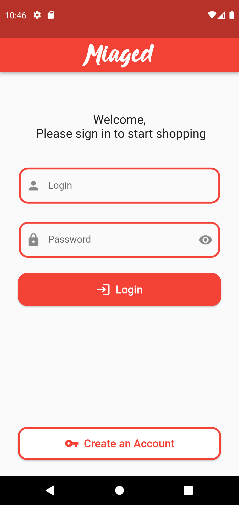
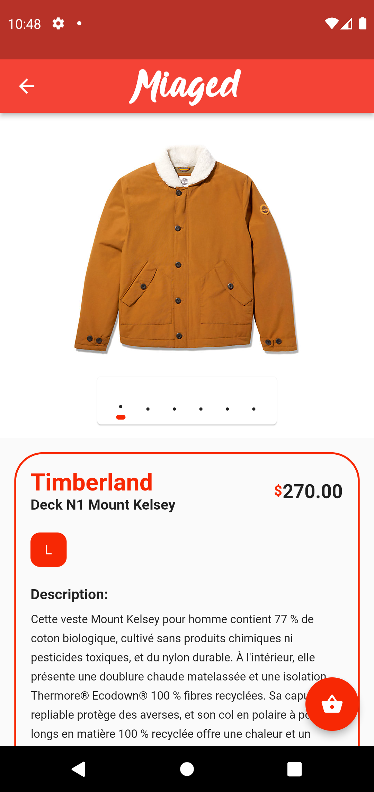
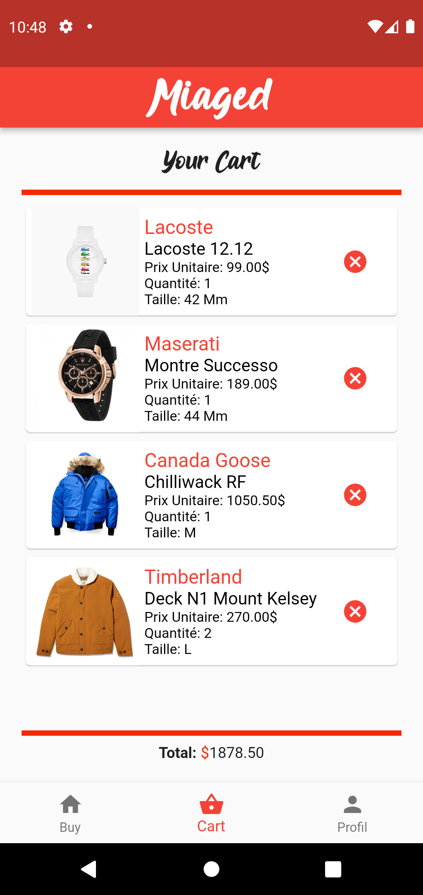
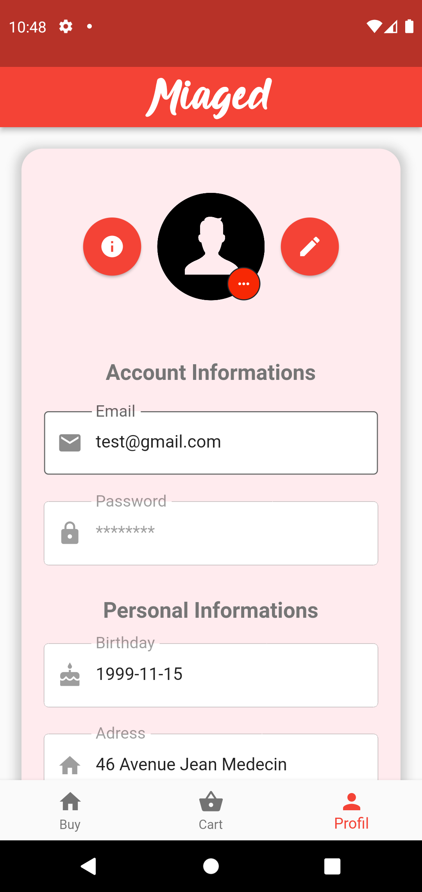

# MIAGED_Flutter

## Login & Password du compte par defaut

- **Login**: test@gmail.com
- **Password**: abc123
 
## Prérequis

Afin de pouvoir utiliser ce projet, vous devez avoir installé sur votre machine le framework Flutter. Pour ce faire veuillez vous référer à la documentation officielle [disponible ici](https://flutter.dev/docs/get-started/install).

## Screenshot

Login Page            |  Register Page            | Product List Page| Product Page| Cart Page| Profil Page
:-------------------------:|:-------------------------:|:-------------------------:|:-------------------------:|:-------------------------:|:-------------------------:
  |  |  |  |  |  

## Realisation

**Interface de login** : Critère d’acceptance

- [x] Au lancement de l’application, une interface de login composée d’un headerBar
qui contient le nom de l’application, de deux champs et d’un bouton m’est proposée.
- [x] Les deux champs de saisie sont : Login et Password.
- [x] Le champ de saisie du password est obfusqué.
- [x] Le label du bouton est : Se connecter.
- [x] Au clic sur le bouton « Se connecter », une vérification en base est réalisée. 
     - Si l’utilisateur existe, celui-ci est redirigé sur la page suivante. 
     - Si celui-ci n’existe pas, à minima un log est affiché dans la console et l’application reste fonctionnelle.
- [x] Au clic sur le bouton « Se connecter » avec les deux champs vides, l’application doit rester fonctionnelle.

**Liste de vêtements** : Critère d’acceptance

- [x] Une fois connecté, l’utilisateur arrive sur cette page composée du contenu principal et d’une BottomNavigationBar composée de trois entrées et leurs icones correspondantes :
    - **Acheter**,
    - **Panier**,
    - **Profil**
- [x] La page actuelle est la page Acheter. Son icone et son texte sont d’une couleur différente des autres entrées.
- [x] Une liste déroulante de tous les vêtements m’est proposé à l’écran.
- [x] Chaque vêtement affiche les informations suivantes :
    - Une image (ne pas gérer les images dans l’application, seulement insérer des liens vers des images d’internet),
    - Un titre,
    - La taille,
    - Le prix
- [x] Au clic sur une entrée de la liste, le détail est affiché.
- [x] Cette liste de vêtements est récupérée de la base de données.

**Détail d’un vêtement ** : Critère d’acceptance

- [x] La page de détail est composée des informations suivantes :
    - Une image,
    - Un titre,
    - La taille,
    - La marque,
    - Le prix
- [x] La page est également composée d’un bouton « Retour » pour retourner à la liste des vétements et d’un bouton « Ajouter au panier », ajoutant le vêtement dans le panier de
l’utilisateur (ajout en base).

**Le panier** : Critère d’acceptance

- [x] Au clic sur le bouton « Panier », la liste des vêtements du panier de l’utilisateur
est affichée avec les informations suivantes :
    - Une image (ne pas gérer les images dans l’application, seulement insérer des liens vers des images d’internet),
    - Un titre,
    - La taille,
    - Le prix
- [x] Un total général est affiché à l’utilisateur (somme de tous les vêtements du panier).
- [x] A droite de chaque vetement, une croix permet à l’utilisateur de retirer un produit. Au clic sur celle-ci, le produit est retiré de la liste et le total général mis à jour.
- [x] Aucun autre bouton d’action n’est présent sur la page (pas de paiement pour le moment).

**Profil utilisateur** : Critère d’acceptance

- [x] Au clic sur le bouton « Profil », les informations de l’utilisateur s’affichent (récupérées en base de données).
- [x] Les informations sont :
    - Le login (readonly),
    - Le password (offusqué),
    - L’anniversaire,
    - L’adresse,
    - Le code postale (affiche le clavier numérique et n’accepte que les chiffres),
    - La ville
- [x] Un bouton « Valider » permet de sauvegarder les données (en base de données).
- [x] Un bouton « Se déconnecter » permet de revenir à la page de login.

**Filtrer sur la liste des vêtements** : Critère d’acceptance

- [x] Sur la page « Acheter », une [TabBar](https://flutter.dev/docs/cookbook/design/tabs) est présente, listant les différentes catégories de vêtements.
- [x] Par défaut, l’entrée « Tous » est sélectionnée et tous les vêtements sont affichés.
- [x] Au clic sur une des entrées, la liste est filtrée pour afficher seulement les vêtements correspondants à la catégorie sélectionnée.

** Laisser libre cours à votre imagination**

- [x] Ajout d'une page de creation de compte
    - L'utilisateur enseigne une adresse mail, un mot de passe et une confirmation du mot de passe.
    - Si l'utilisateur remplis correctement les champs et que le mot de passe et asser securisé, le compte et enregistrer en base de donnée.
- [x] Ajout d'un carousel dans la page de produit afin d'afficher les differentes images de ce dernier.